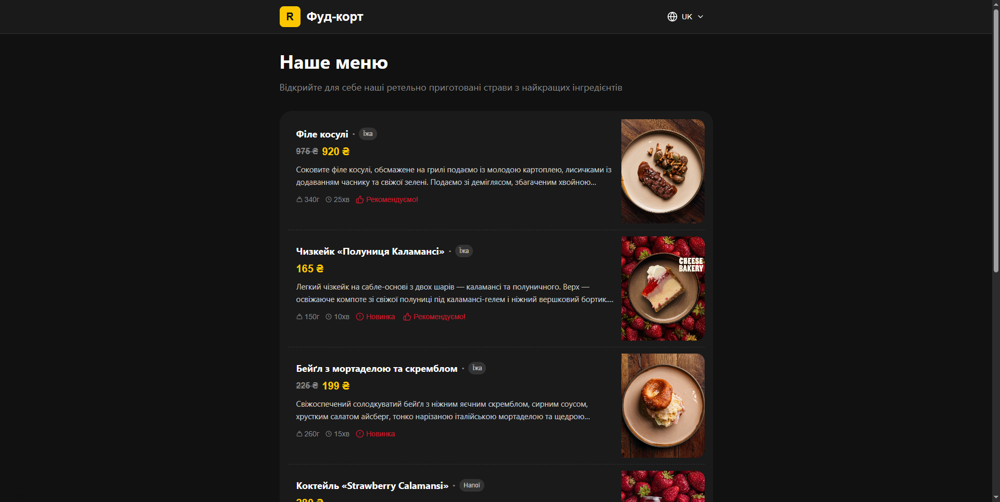
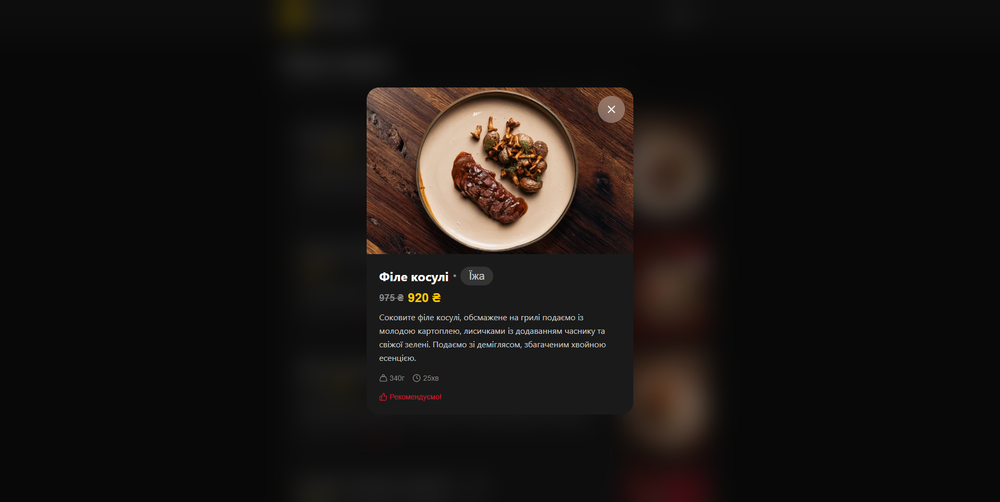
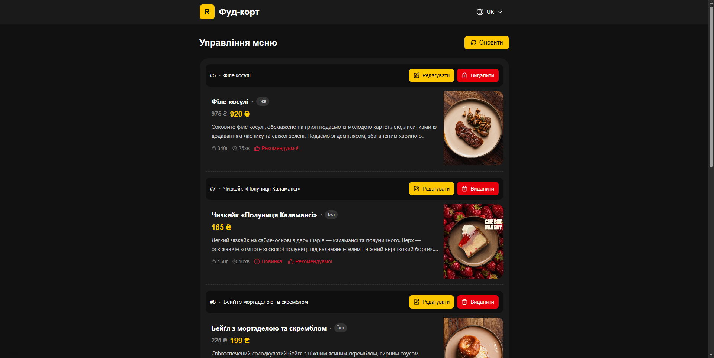
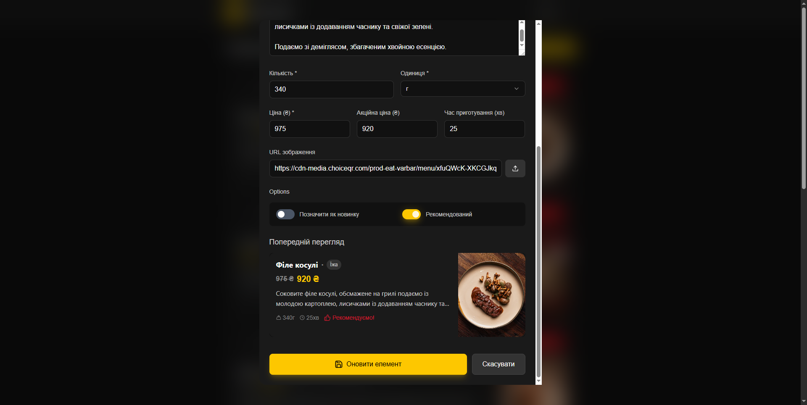
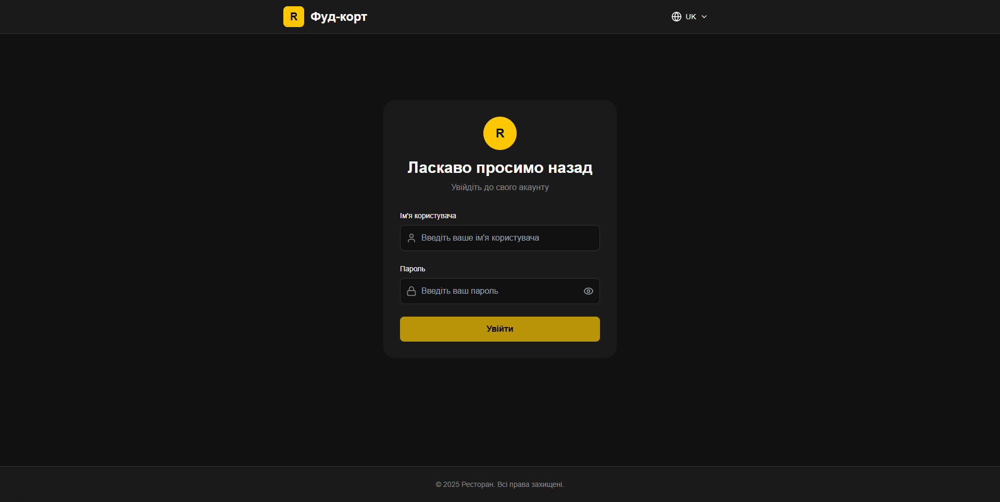

# 🍕 FoodCourt-Frontend — Меню для фуд-корта BeerHop.

> **FoodCourt-Frontend** — это, оптимизированная под мобильные устройства, веб-платформа для просмотра и управления меню фуд-корта BeerHop.



---

## 🚀 Возможности

- **Меню фуд-корта** — просмотр меню фуд-корта BeerHop.
- **Управление меню** — авторизация для администраторов и удобная панель управления.

---

## 🛠️ Технологический стек

- **[Next.js 14+](https://nextjs.org/)** — современный React-фреймворк для SSR и SSG
- **[React](https://reactjs.org/)** — компонентный UI
- **[Tailwind CSS](https://tailwindcss.com/)** — быстрая и гибкая стилизация
- **TypeScript** — строгая типизация
- **API интеграции** с криптовалютными биржами и кошельками

---

## ⚡ Установка и запуск

### 🔹 1. Клонируйте репозиторий

```bash
git clone https://github.com/TerraFaster/FoodCourt-Frontend.git
cd FoodCourt-Frontend
```

### 🔹 2. Установите зависимости
**💻 Windows**

```bash
npm install
```
или
```bash
yarn install
```

**💻 Linux (Ubuntu/Debian/Fedora/Arch)**

Убедитесь, что Node.js и npm установлены
```bash
# Ubuntu/Debian:
sudo apt update && sudo apt install -y nodejs npm
# Fedora:
sudo dnf install -y nodejs npm
# Arch:
sudo pacman -S nodejs npm
```

Установка зависимостей
```bash
npm install
```

### 🔹 3. Настройка подключения к API
Создайте файл `.env.local` в корне проекта (где находится README.md) и добавьте свою ссылку на API по этому примеру:

```bash
NEXT_PUBLIC_API_BASE_URL=https://localhost:5000
```

### 🔹 4. Запуск в режиме разработки
```bash
npm run dev
```

По умолчанию проект будет доступен по адресу:
👉 http://localhost:3000

### 🔹 5. Сборка и запуск в production
```bash
npm run build
npm run start
```

## 🖼️ Скриншоты
Главная страница


Подробнее о блюде меню



---

Страница администратора



Страница администратора (изменение блюда)



---

Страница авторизации


